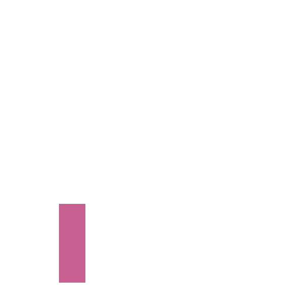

<!-- Mi Perfil ***************************************** -->

<h1 align="center">
 Hola! Yo soy (FV) Fravelz 
</h1>

<h2 align="center">Desarrollador Web | Frontend | UX/UI | Minimalismo y Funcional </h2>

> <b>💎 *1% Mejor que Ayer...*</b>
>
> *"El reflejo de quienes somos, dependen de los hábitos que tengamos"* - Fravelz

  

<!-- Sobre Mi ****************************************** -->

<h2 align="center"><b>Sobre Mi</b> </h2>

<picture> </picture>

  

**Desarrollo Web Básico:**

**Bibliotecas/Frameworks:**

<table>
  <tr>
   <td>
        <b>Herramientas:</b>
   </td>

   <td>
        
   </td>
 </tr>

  <tr>
   <td>
   <b>Extras (No orientadas a desarrollo web):</b>
   </td>

   <td>
        
   </td>
 </tr>
</table>

 

<!-- Paginas Principales ******************************* -->

<h2 align="center">Paginas Principales</h2>

<table>
  <tr>
    <td>
      <a href="https://fravelz.vercel.app/ " target=" _blank">
        
          
        
Ir a Portafolio Web

      </a>
    </td>
    <td>
      <a href="https://web-pruebas-icfes.web.app/" target=" _blank">
        
          
       
Ir a Proyecto ICFES Master (200 OK, en desarrollo)

      </a>
    </td>
  </tr>
</table>

 

<!-- Github Estadisticas ******************************* -->

  

  <b>Estadisticas de Github</b>
  
  

   

  <table>
    <tr>
      <td>
         
          
        
      </td>
    </tr>
    <tr>
      <td>

⠀⠀⠀⠀⠀⠀⠀⠀⠀⠀⠀⠀⠀⣀⣀⣤⣤⣤⣤⡼⠀⢀⡀⣀⢱⡄⡀⠀⠀⠀⢲⣤⣤⣤⣤⣀⣀⡀⠀⠀⠀⠀⠀⠀⠀⠀⠀⠀⠀⠀
⠀⠀⠀⠀⠀⠀⠀⠀⠀⣠⣴⣾⣿⣿⣿⣿⣿⡿⠛⠋⠁⣤⣿⣿⣿⣧⣷⠀⠀⠘⠉⠛⢻⣷⣿⣽⣿⣿⣷⣦⣄⡀⠀⠀⠀⠀⠀⠀⠀⠀
⠀⠀⠀⠀⠀⠀⢀⣴⣞⣽⣿⣿⣿⣿⣿⣿⣿⠁⠀⠀⠠⣿⣿⡟⢻⣿⣿⣇⠀⠀⠀⠀⠀⣿⣿⣿⣿⣿⣿⣿⣿⣟⢦⡀⠀⠀⠀⠀⠀⠀
⠀⠀⠀⠀⠀⣠⣿⡾⣿⣿⣿⣿⣿⠿⣻⣿⣿⡀⠀⠀⠀⢻⣿⣷⡀⠻⣧⣿⠆⠀⠀⠀⠀⣿⣿⣿⡻⣿⣿⣿⣿⣿⠿⣽⣦⡀⠀⠀⠀⠀
⠀⠀⠀⠀⣼⠟⣩⣾⣿⣿⣿⢟⣵⣾⣿⣿⣿⣧⠀⠀⠀⠈⠿⣿⣿⣷⣈⠁⠀⠀⠀⠀⣰⣿⣿⣿⣿⣮⣟⢯⣿⣿⣷⣬⡻⣷⡄⠀⠀⠀
⠀⠀⢀⡜⣡⣾⣿⢿⣿⣿⣿⣿⣿⢟⣵⣿⣿⣿⣷⣄⠀⣰⣿⣿⣿⣿⣿⣷⣄⠀⢀⣼⣿⣿⣿⣷⡹⣿⣿⣿⣿⣿⣿⢿⣿⣮⡳⡄⠀⠀
⠀⢠⢟⣿⡿⠋⣠⣾⢿⣿⣿⠟⢃⣾⢟⣿⢿⣿⣿⣿⣾⡿⠟⠻⣿⣻⣿⣏⠻⣿⣾⣿⣿⣿⣿⡛⣿⡌⠻⣿⣿⡿⣿⣦⡙⢿⣿⡝⣆⠀
⠀⢯⣿⠏⣠⠞⠋⠀⣠⡿⠋⢀⣿⠁⢸⡏⣿⠿⣿⣿⠃⢠⣴⣾⣿⣿⣿⡟⠀⠘⢹⣿⠟⣿⣾⣷⠈⣿⡄⠘⢿⣦⠀⠈⠻⣆⠙⣿⣜⠆
⢀⣿⠃⡴⠃⢀⡠⠞⠋⠀⠀⠼⠋⠀⠸⡇⠻⠀⠈⠃⠀⣧⢋⣼⣿⣿⣿⣷⣆⠀⠈⠁⠀⠟⠁⡟⠀⠈⠻⠀⠀⠉⠳⢦⡀⠈⢣⠈⢿⡄
⣸⠇⢠⣷⠞⠁⠀⠀⠀⠀⠀⠀⠀⠀⠀⠀⠀⠀⠀⠀⠀⠙⠻⠿⠿⠋⠀⢻⣿⡄⠀⠀⠀⠀⠀⠀⠀⠀⠀⠀⠀⠀⠀⠀⠈⠙⢾⣆⠈⣷
⡟⠀⡿⠁⠀⠀⠀⠀⠀⠀⠀⠀⠀⠀⠀⠀⠀⠀⠀⠀⠀⠀⠀⣴⣶⣤⡀⢸⣿⠇⠀⠀⠀⠀⠀⠀⠀⠀⠀⠀⠀⠀⠀⠀⠀⠀⠀⢻⡄⢹
⡇⠀⠃⠀⠀⠀⠀⠀⠀⠀⠀⠀⠀⠀⠀⠀⠀⠀⠀⠀⠀⠀⢸⡇⠀⠈⣿⣼⡟⠀⠀⠀⠀⠀⠀⠀⠀⠀⠀⠀⠀⠀⠀⠀⠀⠀⠀⠈⠃⢸
⢡⠀⠀⠀⠀⠀⠀⠀⠀⠀⠀⠀⠀⠀⠀⠀⠀⠀⠀⠀⠀⠀⠈⠻⠶⣶⡟⠋⠀⠀⠀⠀⠀⠀⠀⠀⠀⠀⠀⠀⠀⠀⠀⠀⠀⠀⠀⠀⠀⡼
⠈⠀⠀⠀⠀⠀⠀⠀⠀⠀⠀⠀⠀⠀⠀⠀⠀⠀⠀⠀⠀⠀⠀⢀⡾⠋⠀⠀⠀⠀⠀⠀⠀⠀⠀⠀⠀⠀⠀⠀⠀⠀⠀⠀⠀⠀⠀⠀⠀⠁
⠀⠀⠀⠀⠀⠀⠀⠀⠀⠀⠀⠀⠀⠀⠀⠀⠀⠀⠀⠀⠀⠀⠀⢸⡁⢠⠀⠀⠀⠀⠀⠀⠀⠀⠀⠀⠀⠀⠀⠀⠀⠀⠀⠀⠀⠀⠀⠀⠀⠀
⠀⠀⠀⠀⠀⠀⠀⠀⠀⠀⠀⠀⠀⠀⠀⠀⠀⠀⠀⠀⠀⠀⠀⢀⣿⣿⣼⣀⣠⠂⠀⠀⠀⠀⠀⠀⠀⠀⠀⠀⠀⠀⠀⠀⠀⠀⠀⠀⠀⠀

      </td>
    </tr>
  </table>

 

 

<!-- Despedida ***************************************** -->

  <samp>Fravelz: Nos Vemos :)</samp>

